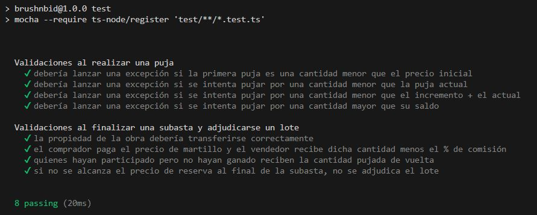

# Hito 2: Integración continua - Información acerca de los tests

Los tests realizados se encuentran en la ruta `test/subastas.test.ts`, y la orden para
ejecutarlos manualmente es la siguiente:

```bash
npm run test-models
```



El workflow definido para la integración continua en GitHub Actions está en la ruta
`.github/workflows/node.yml`.

La integración continua permite automatizar la ejecución de dichos tests cada vez que se hace un
push en el que se han modificado los ficheros relacionados con los modelos y sus test correspondientes.

## Versiones de Node probadas

En el workflow de GitHub Actions `node.yml`, se prueban las siguientes
versiones de Node:

1. *LTS (Long Term Support) anterior* (`lts/-1`): el lanzamiento LTS más
reciente antes del actual. Representa una versión estable y de largo
soporte.
2. *Versión actual* (`current`): es la versión más reciente y puede incluir
características más nuevas que aún no se han incorporado a las LTS. Se
prueba para comprobar que el código sea compatible con las características
más actuales de Node.js.
3. *El resto de versiones LTS* (`lts/*`): incluye todas las versiones LTS
disponibles.

## Capturas de los tests en GitHub Actions

- [Test versión actual de Node](../imgs/test-ci-1.JPG)
- [Test versión LTS-1](../imgs/test-ci-2.JPG)
- [Test versiones LTS](../imgs/test-ci-3.JPG)
