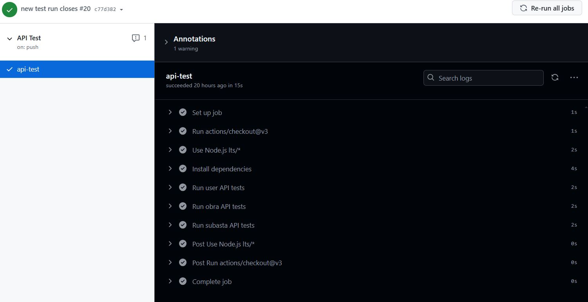
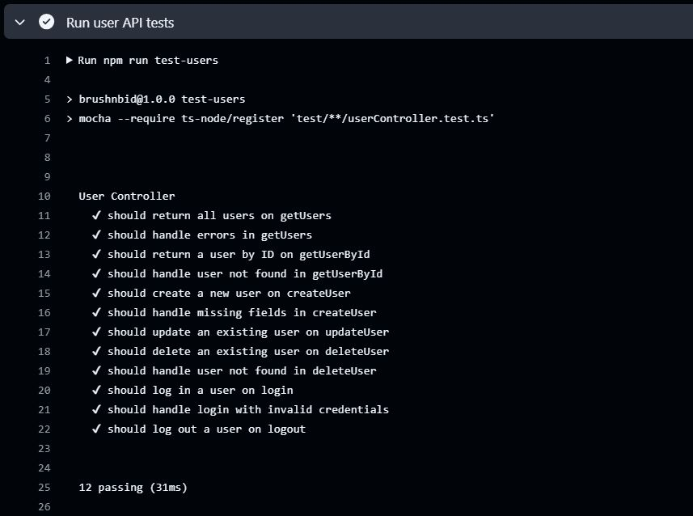
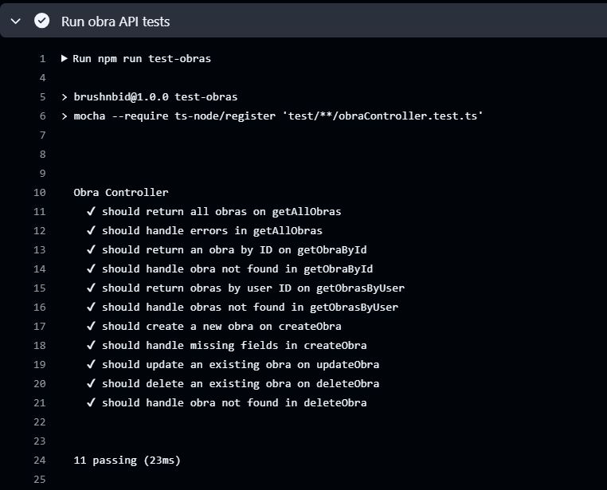
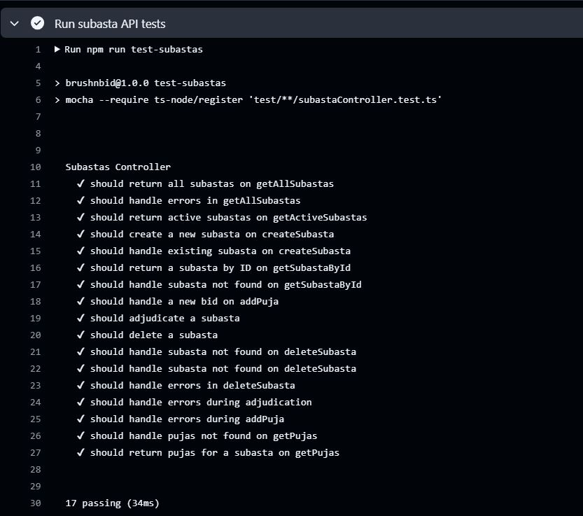

# Hito 3: Diseño de microservicios - Capturas de los tests

Los tests de la API realizados se encuentran en la carpeta `test`, y las órdenes
para ejecutarlos manualmente son las siguientes:

```bash
npm run test-users      # Ejecuta los tests de User Controller
npm run test-obras      # Ejecuta los tests de Obra Controller
npm run test-subastas   # Ejecuta los tests de Subasta Controller
npm test                # Ejecuta las tres órdenes anteriores
```

El workflow definido para la integración continua en GitHub Actions está en la ruta
`.github/workflows/api.yml`. A continuación se proporcionan capturas de la ejecución
con éxito de dichos tests:



La integración continua permite automatizar la ejecución de dichos tests cada vez que se hace un
push en el que se han modificado los ficheros relacionados con la API (controladores, routes y
sus tests correspondientes).

Los tests concretos para cada controlador se encuentran en las siguientes imágenes:

## Tests de User Controller



## Tests de Obra Controller



## Tests de Subasta Controller


