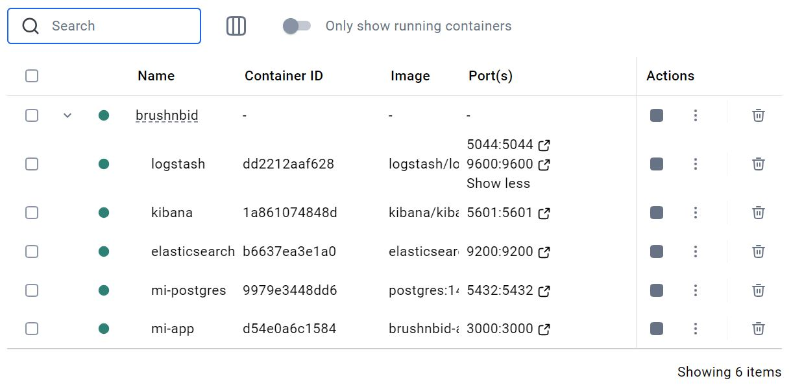

# Hito 3: Composición de servicios - Justificación de herramientas

En este documento se justifica la elección de las herramientas para la realización del hito 3.

## 1. Elección de las imágenes base

Se tomará una decisión con respecto a la elección de imagen base a partir de los siguientes criterios:

1. *Compatibilidad con herramientas actuales*: debe ser compatible con las herramientas
instaladas actualmente en el proyecto.
2. *Tamaño y rendimiento*: lo más habitual es que una imagen que ocupe un espacio reducido
sea más rápida a la hora de iniciarse, al no tener que cargar tantos datos. El tamaño
de las imágenes se revisará en Docker Hub y el rendimiento dependerá del tiempo que tarde
en ejecutar los tests el contenedor.
3. *Mantenimiento*: este aspecto será evaluado se basará en cuándo fue la última vez que
se actualizó, y si recibe actualizaciones de manera frecuente, lo que se verificará en
Docker Hub.
4. *Seguridad*: no debería tener serias vulnerabilidades. Esto se comprobará según las
vulnerabilidades registradas en Docker Hub.

### 1.1. Imagen base para la app

Entre las opciones de imágenes consideras para la creción de un entorno de pruebas aislado, se encuentran:

* [**Node (tag slim)**](https://hub.docker.com/_/node): imagen oficial de Node.js con herramientas esenciales
para el desarrollo.
* [**CircleCI Node**](https://hub.docker.com/r/cimg/node): imagen de Node.js optimizada para su uso
en entornos CI/CD (Continuous Integration/Continuous Deployment).
* [**Bitnami Node**](https://hub.docker.com/r/bitnami/node): imagen de Node.js de Bitnami, una pila
de aplicaciones preconfigurada para facilitar la implementación.
* [**Alpine**](https://hub.docker.com/_/alpine): imagen mínima basada en Alpine Linux, ideal para
contenedores pequeños y eficientes.

Finalmente se optó por **Alpine para Node**, en concreto, [`node:23.4-alpine`](https://hub.docker.com/layers/library/node/23.4-alpine/images/sha256-d1ff461baff28da8bd4b64f84e451513fdf65787dcf3e18119575400ecd7723b?context=explore).

1. *Compatibilidad con herramientas actuales*: al ser de `node` ya viene con Node.js preinstalado,
por lo que es totalmente compatible con el proyecto.
2. *Tamaño y rendimiento*: inicialmente ocupa 53.54 MB, y como no es necesario instalar Node,
se considera un tamaño aceptable.
3. *Mantenimiento*: tiene el sello de imagen oficial en Docker Hub y es actualizado
regularmente, siendo la última actualización hace el 10/12/2024.
4. *Seguridad*: no presenta vulnerabilidades, lo que se puede observar en la propia página de
[Docker Hub](https://hub.docker.com/layers/library/node/23.4-alpine/images/sha256-d1ff461baff28da8bd4b64f84e451513fdf65787dcf3e18119575400ecd7723b?context=explore).

También se ha creado un fichero `.dockerignore` para evitar la copia de determinados archivos
durante la creación de contenedores.

### 1.2. Imagen base para la BD

Dado que la base de datos elegida para el almacenamiento de información de la aplicación es
PostgreSQL, se ha seleccionado la imagen base oficial de Postgre, concretamente, [`postgres:14`](https://hub.docker.com/layers/library/postgres/14/images/sha256-f4a59f09bd38e44c44d54b54df4c549ab0db7aa607066e12ea5b6429574576f2?context=explore).

1. *Compatibilidad con herramientas actuales*: al haber utilizado PostgreSQL para la creación
de las estructuras de la base de datos de la app, se garantiza su compatibilidad con el
toolchain actual.
2. *Tamaño y rendimiento*: la imagen oficial de PostgreSQL 14 está optimizada para ser ligera.
Esto resulta en tiempos de inicio rápidos y un menor consumo de recursos, lo que mejora el
rendimiento general y agiliza los procesos de desarrollo y despliegue.
3. *Mantenimiento*: al tratarse de la imagen oficial, recibe actualizaciones frecuentes y
regulares en Docker Hub, lo que garantiza que se incluyan las últimas mejoras y correcciones.
4. *Seguridad*: aunque presenta algunas vulnerabilidades, su estatus oficial garantiza que
estas son monitoreadas y gestionadas de manera proactiva por el equipo de mantenimiento.

### 1.3. Imagen base para el sistema de logs

La elección de la pila **[ELK (Elasticsearch, Logstash, Kibana)](https://www.elastic.co/es/elastic-stack)** para gestionar los logs en un
entorno de contenedores se basa en su capacidad para manejar grandes volúmenes de datos de
manera eficiente, su flexibilidad y sus potentes herramientas de visualización.

* **Elasticsearch**: permite almacenar y buscar logs de forma escalable. [elasticsearch:7.17.9](https://hub.docker.com/layers/library/elasticsearch/7.17.9/images/sha256-56789f44fd8c451fdeb40a095c5089367e588c7a24e0a03cdbd6ba53ebd84649?context=explore).
* **Logstash**: proporciona un pipeline configurable para procesar y transformar los datos
entrantes. [logstash:7.17.9](https://hub.docker.com/layers/library/logstash/7.17.9/images/sha256-8a747338840cb6e49104a1562f33b570abcef33fc273101069a32b92a3291e9d?context=explore).
* **Kibana**: ofrece una interfaz gráfica intuitiva que facilita el análisis y monitoreo
de los logs en tiempo real. [kibana:7.17.9](https://hub.docker.com/layers/library/kibana/7.17.9/images/sha256-aefb8ca90b82030e22037a957dee4bff9236eea235324375f19e8922eaa20502?context=explore).

Este ecosistema se adapta perfectamente a entornos distribuidos como clusters de contenedores,
permitiendo identificar rápidamente problemas y optimizar el rendimiento del sistema.

1. **Compatibilidad con herramientas actuales**: al integrar la pila ELK, se garantiza una
buena compatibilidad con las herramientas utilizadas actualmente. Además, estos tres elementos
funcionan en conjunto como una potente herramienta para monitorización y logging.
2. **Tamaño y rendimiento**: las imágenes oficiales de la pila ELK están optimizadas para ser
eficientes en cuanto a tamaño y rendimiento.
3. **Mantenimiento**: dado que son imágenes oficiales, reciben actualizaciones frecuentes
 en Docker Hub. Esto contribuye a que se mantenga la estabilidad de la infraestructura.
4. **Seguridad**: con su sello oficial, la confianza en la rápida resolución de vulnerabilidades
y configuraciones de seguridad recomendadas minimizan los riesgos asociados.

## 2. Estructura del clúster de contenedores

### 2.1. Redes

Todos los servicios están conectados a una red llamada `brushnbid-network`, que utiliza el
controlador `bridge`. Esto asegura que los contenedores puedan comunicarse entre sí usando
nombres de contenedor como hosts.

## 2.2. Contenedores, volúmenes y dependencias

Los contenedores están diseñados para colaborar entre sí, cada uno cumpliendo un rol específico
en el ecosistema de la aplicación.

1. `app` (aplicación principal): es el punto de entrada para los usuarios y la lógica de negocio.
Se comunica con db para el acceso a la base de datos y con logstash para el envío de logs, de
los que depende, asegurando que estén disponibles antes de iniciar. Expone el puerto 3000 para la
interacción externa.
2. `db` (base de datos PostgreSQL): almacena los datos estructurados utilizados por la aplicación.
Usa un volumen persistente (`pgdata`) para garantizar la retención de datos entre reinicios.
Permite que otros contenedores (como `app`) se conecten a través del puerto 5432.
3. `elasticsearch` (motor de búsqueda y almacenamiento de logs): proporciona un backend para
almacenar y buscar logs y otros datos. Se comunica con `logstash`, que le envía logs procesados,
y con `kibana`, que consulta los datos para visualización. Utiliza un volumen persistente (`esdata`)
para mantener los datos indexados de forma segura.
4. `logstash` (procesador de logs): recibe logs desde app, los procesa y los envía a elasticsearch,
del que depende para asegurarse de que puede enviar datos procesados.
5. `kibana` (interfaz de monitoreo y visualización): ofrece una interfaz gráfica para consultar y
analizar los datos almacenados en elasticsearch, del que depende para obtener los datos necesarios.

### 2.3. Otros detalles de configuración

* Los contenedores se comunican usando los nombres definidos en el archivo, por ejemplo, `db`, `logstash`
o `elasticsearch`.
* Las variables de entorno como `DB_HOST` y `ELASTICSEARCH_HOSTS` especifican las direcciones de otros servicios.
* Se definen límites de recursos para algunos contenedores: elasticsearch tiene límites de memoria (`mem_limit`)
y opciones de Java optimizadas, al igual que logstash, ajustado mediante variables de entorno (`LS_JAVA_OPTS`).
* Los logs del contenedor `app` están configurados con un controlador de registro (`json-file`) que limita el
tamaño y número de archivos para evitar saturar el almacenamiento.

### 2.4. Captura en Docker Desktop del clúster en ejecución

