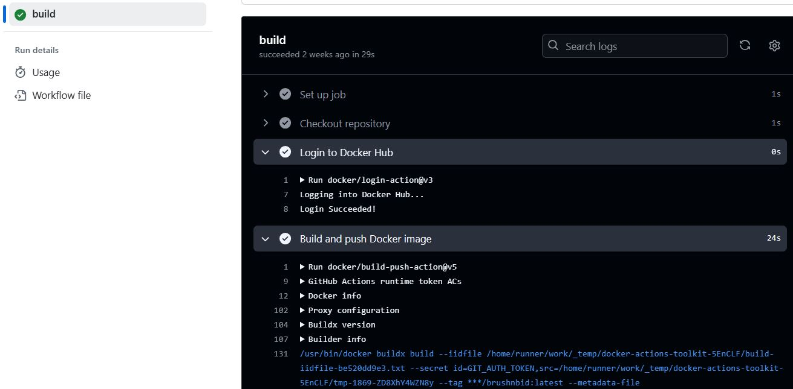
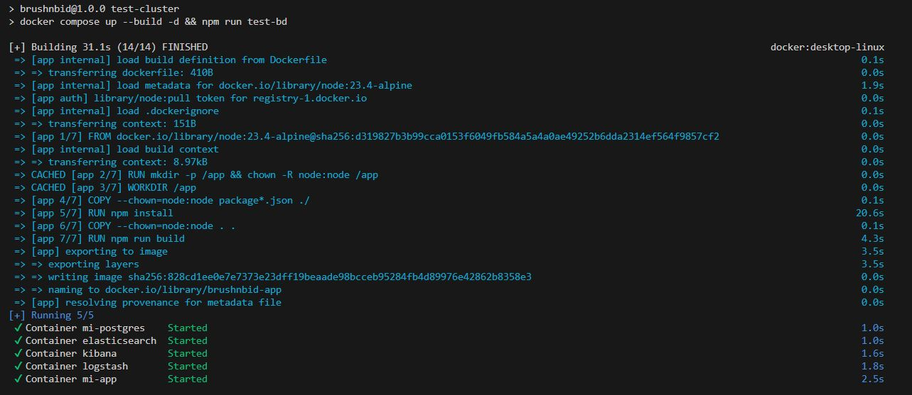
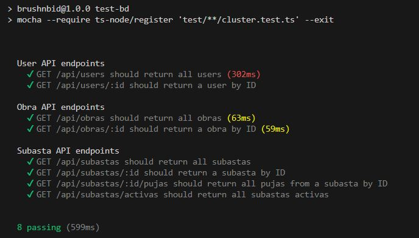
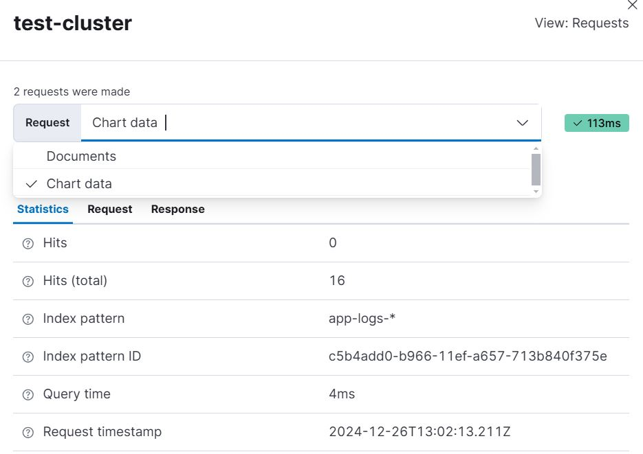

# Hito 4: Composición de servicios - Capturas de tests y logs

En este documento se incluyen las explicaciones y capturas relacionadas con los tests,
la CI y la visualización de logs.

## 1. Publicación de las imágenes en Docker Hub

La imagen construida a partir del `Dockerfile` de la aplicación ha sido publicada en Docker Hub,
y puede consultarse en el siguiente enlace: [marinajcs163/brushnbid](https://hub.docker.com/repository/docker/marinajcs163/brushnbid/general)

Para construir la imagen, se ha ejecutado el siguiente comando:

```bash
docker build -t marinajcs163/brushnbid:latest .
```

Se puede descargar la imagen subida en Docker Hub, mediante la siguiente orden:

```bash
docker pull marinajcs163/brushnbid:latest
```

Y para actualizar la imagen publicada cada vez que se realizan cambios en los ficheros
relacionados, se ha incluido un workflow en GitHub Actions: `.github/workflows/docker.yml`.

### 1.1. Captura del test automatizado para la construcción y publicación de la imagen



## 2. Tests API y clúster de contenedores

Los tests adicionales realizados para este hito se encuentran en la carpeta `test`,
y las órdenes para ejecutarlos manualmente son las siguientes:

```bash
npm run test-bd       # Ejecuta los tests de las APIs (con la BD integrada)
npm run test-cluster  # Construye el clúster de contenedores y ejecuta el test anterior
```

El workflow definido para la integración continua de los tests en GitHub Actions es el mismo
del hito anterior, definido en la ruta `.github/workflows/api.yml`.

A continuación se proporcionan capturas de la ejecución con éxito de los nuevos tests y la
visualización de logs:

### 2.1. Captura del test para la construcción del clúster y algunas peticiones a la API





### 2.2. Visualización de logs mediante Kibana

Se ha utilizado la pila ELK para el monitoreo de logs, en concreto, el apoyo visual de Kibana,
que puede consultarse a través de la página de Elasticsearch, accedida desde el navegador:
`http://localhost:5601/app/home#/`.



La imagen anterior corresponde a un ejemplo de inspección de datos en Kibana. En ella, aparece
una pestaña llamada *test-cluster*, en la que se están inspeccionando las solicitudes (*Chart data*)
realizadas, donde:

* *Hits y Hits (total)*: número de registros coincidentes en la consulta y total de documentos evaluados.
* *Patrón de índice*: en esta caso `app-logs-*`, indicando que la consulta se ejecuta sobre índices que
coinciden con ese patrón, cuyo ID es *c5b4add0*...
* *Tiempo de consulta*: lo que tardó en ejecutarse la consulta (4 ms).
* *Timestamp de la solicitud*: marca la fecha y hora en formato UTC de cuando se realizó la solicitud
(26 de diciembre de 2024 a las 13:02:13.211Z).


En la figura previa, se tienen los registros capturados tras la ejecución de `test-db` gracias a la interfaz
gráfica de monitorización que proporciona Kibana.

Se está explorando el índice `app-logs-*` (previamente configurado) con 16 hits visibles en el rango de tiempo
seleccionado (entre 14:00:26.000 y 14:00:27.000 del 26 de diciembre de 2024). Además, se muestra un gráfico de
barras, que representa la distribución de eventos (logs) en el tiempo (número de documentos por intervalo).

Cada línea representa un evento capturado con campos como `@timestamp`, `message`, `severity`, y `_id`.
Un ejemplo de log es el del mensaje: "Pujas obtenidas con éxito para la subasta_id 1", con severidad "info".

Se ha incluido un fichero CSV en la ruta `/logs/test-cluster.csv` con los logs exportados de Kibana, tras
la ejecución de este test.
