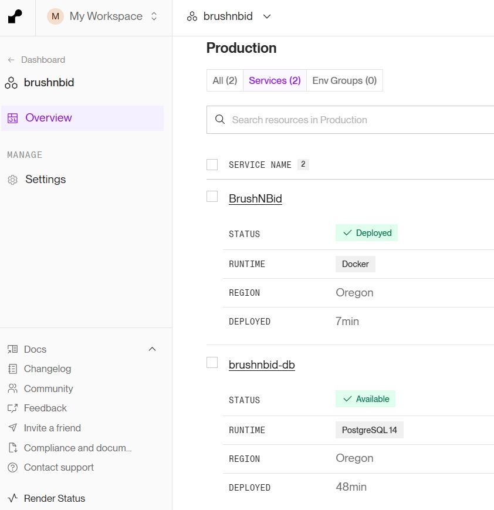
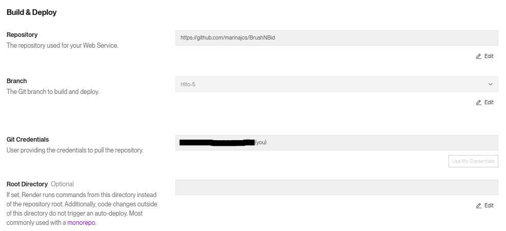
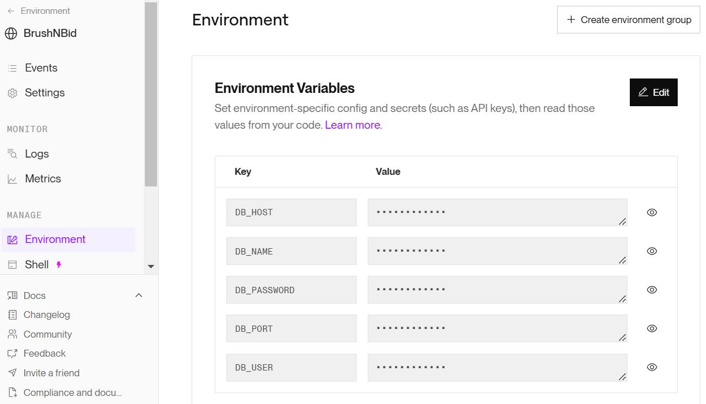
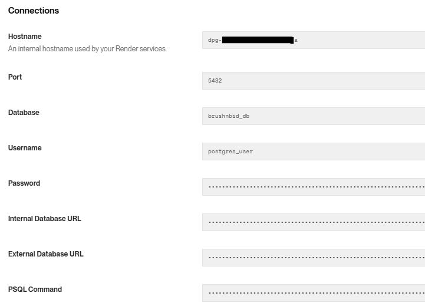
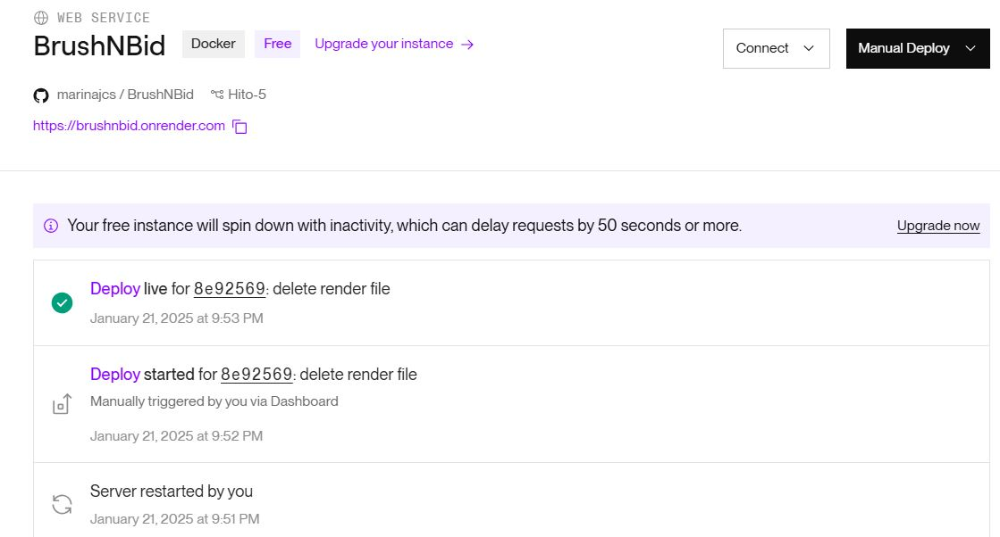
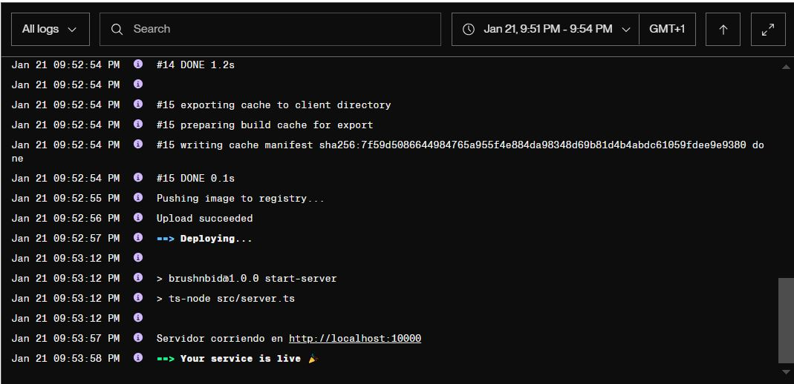
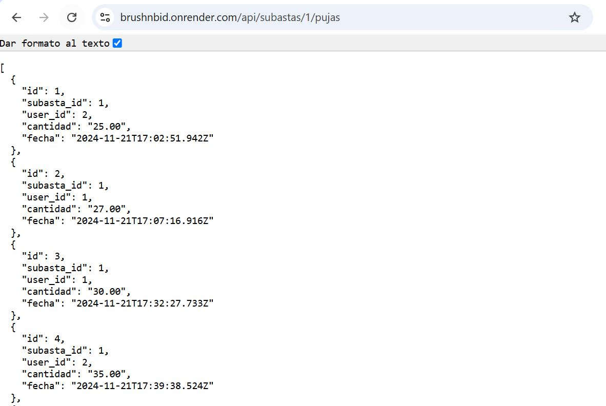
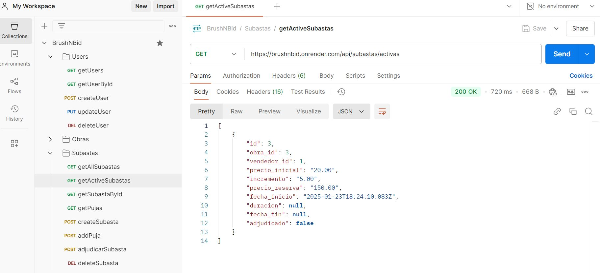

# Hito 5: Despliegue de la aplicación en un PaaS - Configuración en Render

En este documento se explica la configuración realizada en Render para el despliegue
de servicios web.

## 1. Configuración del proyecto en Render

Se ha creado un proyecto completo en Render, configurando todos los servicios necesarios
para garantizar el correcto funcionamiento de la aplicación. Render proporciona un entorno
unificado que facilita la administración de múltiples servicios relacionados dentro de un
mismo proyecto, asegurando la integración y comunicación segura y eficiente entre ellos.

En la figura siguiente, se puede observar el estado activo de los servicios desplegados.

### 1.1. Captura del proyecto creado en Render

## 2. Despliegue de la aplicación

El primer paso fue configurar el servicio de la aplicación principal como un *Web Service*.
Para ello, se vinculó este repositorio de GitHub, que contiene el código fuente de la aplicación,
incluyendo el Dockerfile, con el servicio creado en Render. Este permite detectar automáticamente
el fichero Dockerfile, construyendo y desplegando la aplicación en sus servidores.

Además, se configuraron parámetros clave, como la rama del repositorio a utilizar, la ruta del
Dockerfile, opciones de autodespliegue cada vez que se hace un commit en el repositorio y otras
credenciales adicionales. 

Por otro lado, para que pueda conectarse a la base de datos, es necesario crear las variables de
entorno que se corresponden a las credenciales de conexión del servicio PostgreSQL, también desplegado
como servicio en Render.

Una vez desplegada la app, el PaaS asignó una URL pública desde la cual se puede acceder a la ella:
[https://brushnbid.onrender.com](https://brushnbid.onrender.com)

### 2.1. Capturas de la configuración del servicio web de la app

### 2.2. Captura de la configuración de variables de entorno de la app

## 3. Despliegue de la base de datos

Además de la app, se creó un servicio de base de datos PostgreSQL, aprovechando que Render ofrece una
solución de base de datos PostgreSQL completamente administrada, que incluye características como backups
automáticos, restauración sencilla y escalabilidad.

Durante la configuración, se eligieron parámetros como el tamaño inicial de la base de datos (eligiendo el
plan gratuito) y las credenciales de acceso (nombre de la base de datos, usurio, etc). Una vez creada, Render
generó automáticamente las variables de conexión, como las URLs tanto internas como externas y el hostname,
una variable dentro del contexto de servicios Render, que se incluyó en el entorno de la app principal para
permitir la comunicación entre ambas.

### 3.1. Captura de la información de la base de datos

## 4. Pruebas

La imagen inferior muestra el panel de administración de Render para el servicio web **BrushNBid**, desplegado
desde el repositorio de GitHub `marinajcs/BrushNBid`. El servicio utiliza un archivo Dockerfile para construir
la aplicación y está configurado en el plan gratuito, lo que implica que la instancia entra en modo de reposo
tras un periodo de inactividad, con posibles retrasos de hasta 50 segundos en las solicitudes.

En el historial de despliegues de la figura 4.1, se observa que la última actualización en vivo fue ejecutada
el 21 de enero de 2025 a las 9:53 PM, después de un reinicio previo del servidor a las 9:51 PM.

En las figuras 4.1 y 4.2, se muestran los registros (logs) del último despliegue realizado, y una prueba de
acceso a la URL pública desde el navegador, respectivamente. Por otro lado, se han realizado una serie de
solicitudes en Postman a cada endpoint de la API (consultar la última imagen) publicada en la URL de Render,
para así poder verificar el correcto funcionamiento de la aplicación.

### 4.1. Captura del panel de administración del servicio web de la app

### 4.2. Captura de los logs de una instancia de despliegue

### 4.3. Captura de prueba del funcionamiento de la API desde la URL pública

### 4.4. Captura de solicitudes en Postman a la app desplegada

